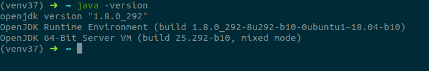
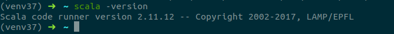
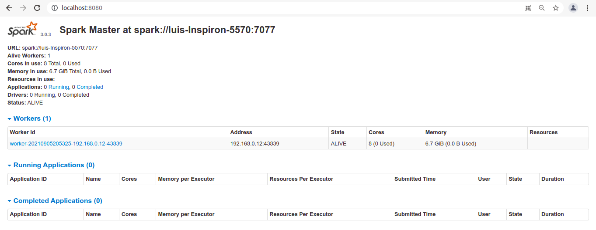
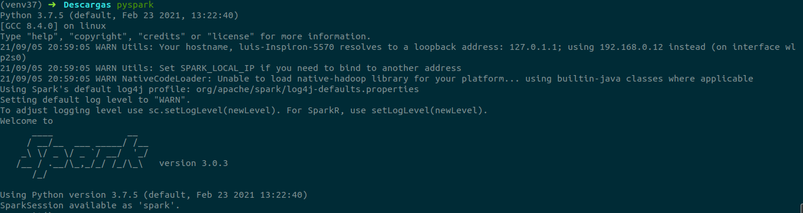

# How to install Apache Spark

## Linux (Debian-Ubuntu based systems)

You need Java and Scala installed on your computer. You can check if your machine has Java installed on your machine,
executing the command:
```shell script
java -version
```


### Install Java

In order to install Java on your computer, you can execute the following commands in a terminal:
```shell script
sudo apt-get update
sudo apt-get install openjdk-8-jdk
java -version
```

The commands listed above install OpenJDK 8, which is a open source Java version compatible with Ophelia.

### Install Scala

In order to install Scala on your computer, you can execute the following commands in your computer:
```shell script
sudo apt-get update
sudo apte-get install scala
scala -version
```

By executing `scala -version`, you can verify that Scala has been successfully installed in your machine:



### Download and install Apache Spark

You can go to the [Apache Spark downloads website](https://spark.apache.org/downloads.html) and get a TGZ file with the
Apache Spark version that you want to install in your machine (recommended Spark 3.0.X). Alternatively, you can download
it with the following command:
```shell script
wget https://www.apache.org/dyn/closer.lua/spark/spark-3.0.3/spark-3.0.3-bin-hadoop2.7.tgz
```
Once downloaded, you have to extract the content of that TGZ file. You can execute the following command:
```shell script
tar -xvzf spark-3.0.3-bin-hadoop2.7.tgz
```
Then, move the recently extracted directory to the /opt directory. You can achieve this executing the following command:
```shell script
sudo mv spark-3.0.3-bin-hadoop2.7 /opt/spark
```

### Add variable environments

You can edit your `~/.profile` file in order to make your interaction with Apache Spark easier in your machine:
```shell script
gedit ~/.profile
```
Then add the following lines at the end of that file:
```shell script
export SPARK_HOME=/opt/spark
export PATH=$PATH:/opt/spark/bin:/opt/spark/sbin
export PYSPARK_PYTHON=/usr/bin/python3
```

Save the file, then load those environment variables by executing the following command:
```shell script
source ~/.profile
```

### Start Apache Spark in pseudo-distributed mode

Run the following commands to start both Spark master and worker services:
```shell script
start-master.sh
start-slaves.sh spark://localhost:7077
```

Now you can go to your [local Spark master](http://localhost:8080/) page and verify the status of the service:



Also, you can execute the commands `spark-submit`, `spark-shell` and `pyspark` to verify the installation.


